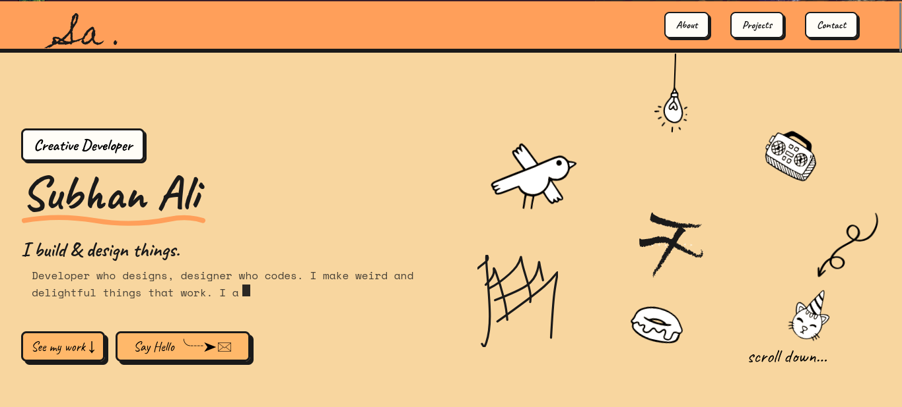

<h1 align="center">hi, i'm subhan.</h1>
<p align="center">this is my corner of the internet — built, broken, and rebuilt a few too many times.</p>
<p align="center">
  <a href="https://subhanali.xyz"><b>→ subhanali.xyz</b></a>
</p>
---

## what is this???
a neo-brutalist portfolio made by me for me consisting of a consistent theme of colors(cream, a shade of orange(#FF0F5A atp its memorized) and ink(#1A1A1A dis is easy to memorize imo)) and also a consistent theme of buttons too
no template no theme.
just me and tailwind and unreasonable amount of hover states.

## built with
- react js
- tailwind css
- react icon(i am not making custom icons)
- react-router-dom(just for a 404 page)
- typewriter effect

### before you start, you'll need

- **Node.js** (v18 or higher)
  check your version: `node -v`
- **npm** (comes bundled with Node) — check with `npm -v`
- **Git** — to clone the repo
- a code editor (I use VS Code, no judgment if you use something else)

## run this locally or just make ur own out of this
```bash
git clone https://github.com/subhanali07/myportfolio
cd meportfolio
pnpm install
pnpm run dev
```
### things worth knowing
 
- everything's responsive — mobile, laptop, desktop, and the mythical 2xl screens nobody actually owns but I designed for anyway
- the 404 page has its own opinions about where you went wrong
- deployed on vercel, with a rewrite so kool URLs land somewhere friendlier than a blank error page
- 
### why
 
built for [hackclub horizons](https://horizons.hackclub.com), fueled by caffeine and me
 
---

